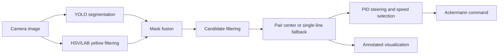

# GEM-YOLO Lane Following

ROS2 autonomous lane-following pipeline for the Polaris GEM simulator using YOLO segmentation, OpenCV lane filtering, and PID steering control.

## Overview

The node consumes a forward camera image, identifies yellow lane boundaries, estimates the center of the current lane, and publishes an Ackermann speed and steering command. YOLO segmentation supplies a learned region proposal while HSV/LAB color filtering preserves the yellow-lane signal. An `ACQUIRE`/`TRACK` controller avoids committing to a lane until two plausible boundaries are visible. Once locked, the tracker can infer the center from one boundary and rejects pairs inconsistent with the tracked lane.



## Key features

- YOLO segmentation with OpenCV yellow-line refinement
- lane-width, center-jump, and tracked-center gates for adjacent-lane rejection
- single-boundary fallback based on the learned lane width
- PID steering with integral limiting, derivative filtering, saturation, and slew limiting
- reduced speed during acquisition, sharp steering, contact warnings, and lane loss
- ROS2 parameters, YAML configuration, portable launch file, and annotated image output

## Repository structure

```text
models/lane_yolo/best.pt             trained segmentation checkpoint (Git LFS)
src/gem_lane_yolo/
  config/lane_follow.yaml            controller and perception defaults
  launch/lane_follow.launch.py       ROS2 launch entry point
  gem_lane_yolo/lane_follow_node.py  integrated perception/control node
  gem_lane_yolo/control.py           ROS-independent control/geometry helpers
  test/                              offline unit tests
tools/evaluate_run.py                telemetry evaluation utility
```

The package also contains camera/dataset collection utilities used with the simulator.

## Requirements

- Ubuntu with ROS2 Humble
- Python 3, NumPy, and OpenCV
- `cv_bridge`, `sensor_msgs`, and `ackermann_msgs`
- [Ultralytics](https://docs.ultralytics.com/) for YOLO inference
- a GEM simulator publishing the configured camera topic and consuming `AckermannDrive`
- Git LFS when cloning the included checkpoint

## Installation

```bash
git lfs install
git clone https://github.com/Zhen1012-01/GEM-YOLO.git
cd GEM-YOLO
python3 -m pip install ultralytics
source /opt/ros/humble/setup.bash
colcon build --packages-select gem_lane_yolo --symlink-install
source install/setup.bash
```

If this repository is not the ROS workspace root, copy or link `src/gem_lane_yolo` into a workspace and keep `models/lane_yolo/best.pt` at the repository-relative location while building. The installed package includes the checkpoint.

## Model

`models/lane_yolo/best.pt` is the segmentation checkpoint used to constrain yellow-lane detections. The repository includes the trained segmentation checkpoint used by the lane-following node; training metadata is not included. No accuracy or simulator-performance figures are claimed. If the model is unavailable, the node warns and continues with the OpenCV mask.

## Running

Start the GEM simulator and its camera/control interfaces, then run:

```bash
ros2 launch gem_lane_yolo lane_follow.launch.py
```

Override a configuration file or parameter when needed:

```bash
ros2 launch gem_lane_yolo lane_follow.launch.py config:=/path/to/lane_follow.yaml
ros2 run gem_lane_yolo lane_follow_node --ros-args -p target_speed:=1.0
```

## ROS2 interfaces

| Direction | Default topic | Message type | Purpose |
|---|---|---|---|
| Subscribe | `/camera/image_raw` | `sensor_msgs/msg/Image` | Forward color camera frame |
| Publish | `/ackermann_cmd` | `ackermann_msgs/msg/AckermannDrive` | Speed and steering command |
| Publish | `/lane_follow/vis` | `sensor_msgs/msg/Image` | Annotated perception/controller state |

All topic names are parameters.

## Parameters

| Parameter | Default | Purpose |
|---|---:|---|
| `model_path` | empty | Override installed `best.pt` path |
| `use_yolo` | `true` | Enable learned segmentation |
| `yolo_confidence` | `0.35` | YOLO confidence |
| `yolo_image_size` | `640` | Inference image size |
| `yolo_every_n_frames` | `2` | Reuse masks between inference frames |
| `yellow_hsv_lower` / `yellow_hsv_upper` | `[14,35,65]` / `[48,255,255]` | Yellow HSV bounds |
| `lab_b_threshold` | `145` | LAB yellow-channel threshold |
| `roi_top_ratio` | `0.40` | Top of road region as height ratio |
| `pid.kp` / `pid.ki` / `pid.kd` | `0.0058` / `0.0` / `0.0022` | Steering PID gains |
| `max_steering` | `0.62` | Absolute steering limit |
| `max_steering_delta` | `0.060` | Per-frame target slew limit |
| `target_speed` / `base_speed` / `minimum_speed` | `2.05` / `1.50` / `0.45` | Speed schedule |
| `lost_speed` | `0.18` | Lane-loss search speed |
| `lane_width_px` | `230.0` | Initial lane-width estimate |
| `minimum_lane_width_px` / `maximum_lane_width_px` | `120.0` / `560.0` | Valid boundary spacing |
| `single_line_gate_px` | `280.0` | One-boundary association gate |
| `maximum_center_jump_px` | `260.0` | Tracked-center rejection gate |

See `config/lane_follow.yaml` for topic and image-save parameters.

## Control logic

During acquisition, the node requires two plausible boundaries and several centered frames before tracking. Tracking scores boundary pairs against the previous center and lane width. With one associated boundary, the other is inferred from the filtered lane width; ambiguous sides and large center jumps are rejected. Pixel center error drives PID steering. Steering magnitude reduces speed on turns, while publication clamps commands. Prolonged loss returns to acquisition and uses a low-speed directed search based on the previous error.

## Visualization

View `/lane_follow/vis` with `rqt_image_view`. The overlay shows candidate regions, selected boundaries, estimated center, state, error, steering, and speed. No captured simulator screenshots are included.

## Testing and evaluation

Offline tests cover command clamping, PID limits, tracked-lane pair selection, single-line inference, and telemetry metrics:

```bash
cd src/gem_lane_yolo
python3 -m pytest test/test_control.py test/test_evaluation.py
```

`tools/evaluate_run.py` supports later evaluation. Given CSV telemetry with `lane_error_px`, `steering`, and `lane_detected` (plus optional latency columns), it reports mean absolute lane error, steering smoothness, lane-loss count, saturation count, and mean latency. `tools/example_telemetry.csv` has headers only; it is not a claimed result.

## Safety and limitations

This is a simulator-focused project, not a real-road driving system. It depends on camera visibility, yellow paint appearance, checkpoint quality, and stable image geometry. Single-line fallback cannot resolve every ambiguous layout. The repository has no closed-loop simulator benchmark or training metadata, and this revision was not validated in the original simulator environment. Real vehicle use would require independent localization, planning, actuation safety, fault monitoring, and extensive validation.

## Future work

- temporal filtering of masks and center estimates
- stronger lane association through curves and intersections
- curve-aware lookahead control
- recorded latency profiling and closed-loop metrics
- integration with planning and vehicle-state feedback
